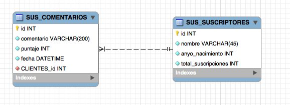

## Escuela Colombiana de Ingeniería

### PDSW – Procesos de desarrollo de Software
### Parcial Segundo Tercio

En los fuentes disponibles en el repositorio se tiene la base de un proyecto para la consulta de los comentarios que han registrado, a través de una aplicación móvil, los suscriptores de una prestigiosa
editorial. La aplicación será usada por los empleados del departamento de control de atención al cliente de dicha editorial, de acuerdo con lo indicado en las siguientes historias de usuario:

  -------------------------------------------------------------------------------------------------------------------------------------------------------------------------------------
  > __HISTORIA DE USUARIO: Consulta de comentarios__
  
  > **Como** empleado del departamento de atención al cliente
  >
  > **Quiero** poder consultar todos los comentarios registrados hasta el momento
  >
  > **Para** poder identificar los comentarios que impliquen más riesgo de que se pierda una suscripción.
  >
  > **Criterio de aceptación:** los comentarios deben estar ordenados por fecha y deben mostrar: fecha, el comentario, y el nombre del cliente.
  -------------------------------------------------------------------------------------------------------------------------------------------------------------------------------------
 >  __HISTORIA DE USUARIO: Consulta por generaciones de comentarios__
 
  > **Como** empleado del departamento de atención al cliente
  >
  > **Quiero** poder consultar los comentarios de los puntajes más bajos (menores o iguales a 3) realizados por mis suscriptores, filtrando por intervalos de años de nacimiento.
  >
  > **Para** poder identificar los problemas que están generando los impactos más negativos, considerando las diferentes generaciones de suscriptores.
  >
  > **Criterio de aceptación:** se debe permitir ingresar el intervalo de años de nacimiento de los suscriptores cuyos comentarios se incluirán en el resultado: (año-inicio .. año-fin)
  -------------------------------------------------------------------------------------------------------------------------------------------------------------------------------------

El modelo de base de datos que soporta la información es el siguiente:



A partir de la aplicación base suministrada, debe realizar lo siguiente:

1.  (20%) A partir de la especificación hecha en el método *comenteriosMasBajosPorRangoNacimiento* de la fachada de servicios (la parte lógica de la aplicación):
	* Defina dos casos de prueba de frontera, y escríbalos en los comentarios de la clase ServicesJUnitTest. 
	* Implemente ÚNICAMENTE un caso de prueba para CADA UNO DE LOS DOS casos de frontera planteados, basándose en la prueba de ejemplo: 'pruebaCeroTest', la cual muestra cómo insertar datos en la base de datos de pruebas (volatil) antes de realizar la prueba. Recuerde que las aserciones deben incluir mensajes claros que indiquen -en caso de que la prueba falle- el defecto detectado.


2.  (40%) Termine la implementación de la capa lógica de la aplicación (ServiciosSuscripcionesImpl). Implemente todo lo que haga falta de la capa de persistencia para poder realizar esto.

3.  (40%) Implemente la capa de presentación (vistas y controladores). Haga la implementación del ManagedBean en la clase ReportesComentariosBean (use este para las dos vistas), y en las dos páginas xhtml provistas, implemente las dos historias de usuario indicadas. 


## Entrega

Siga al pie de la letra estas indicaciones para la entrega de este punto. EL HACER CASO OMISO DE ESTAS INSTRUCCIONES PENALIZARÁ LA NOTA.

1. Limpie el proyecto.

	```bash
$ mvn clean
```

1. Configure su usuario de GIT

	```bash
$ git config --global user.name "Juan Perez"
$ git config --global user.email juan.perez@escuelaing.edu.co
```

2. Desde el directorio raíz (donde está este archivo README.md), haga commit de lo realizado.

	```bash
$ git add .

$ git commit -m "entrega parcial - Juan Perez"
```


3. Desde este mismo directorio, comprima todo con: (no olvide el punto al final en la segunda instrucción)

	```bash
$ zip -r APELLIDO.NOMBRE.zip .
```
4. Abra el archivo ZIP creado, y rectifique que contenga lo desarrollado.

4. Suba el archivo antes creado (APELLIDO.NOMBRE.zip) en el espacio de moodle correspondiente.

5. IMPORTANTE!. Conserve una copia de la carpeta y del archivo .ZIP.
 


